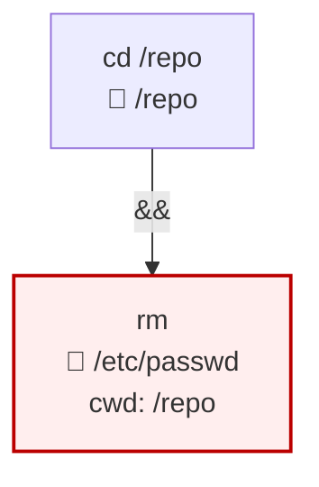

# ShellSyntaxTree

A focused .NET library that parses **bash and PowerShell** command strings
into a structured AST. Purpose-built for tools that need to **reason about
shell commands without running them** — approval gates for LLM-emitted
commands, CI/CD script auditors, sandbox policy generators, audit-log
analytics.

Hand-rolled, AOT-trim friendly, zero native dependencies. Multi-targets
`netstandard2.0` and `net8.0`.

```bash
dotnet add package ShellSyntaxTree --version 0.2.0
```

The `0.2.0` release adds PowerShell support. The latest stable
`0.2.x` package supports bash and PowerShell together. The public surface
documented below tracks the `dev` branch.

## What you get

For an input like `cd /repo && rm /etc/passwd`, ShellSyntaxTree produces:



A two-clause AST where the second clause's `Args` includes a synthetic
`/repo` attribution arg (so consumers can see "this `rm` is implicitly
operating in `/repo`") *and* `/etc/passwd` is resolved and marked
`IsPath = true`. Hard-deny rules over `/etc/*`…
