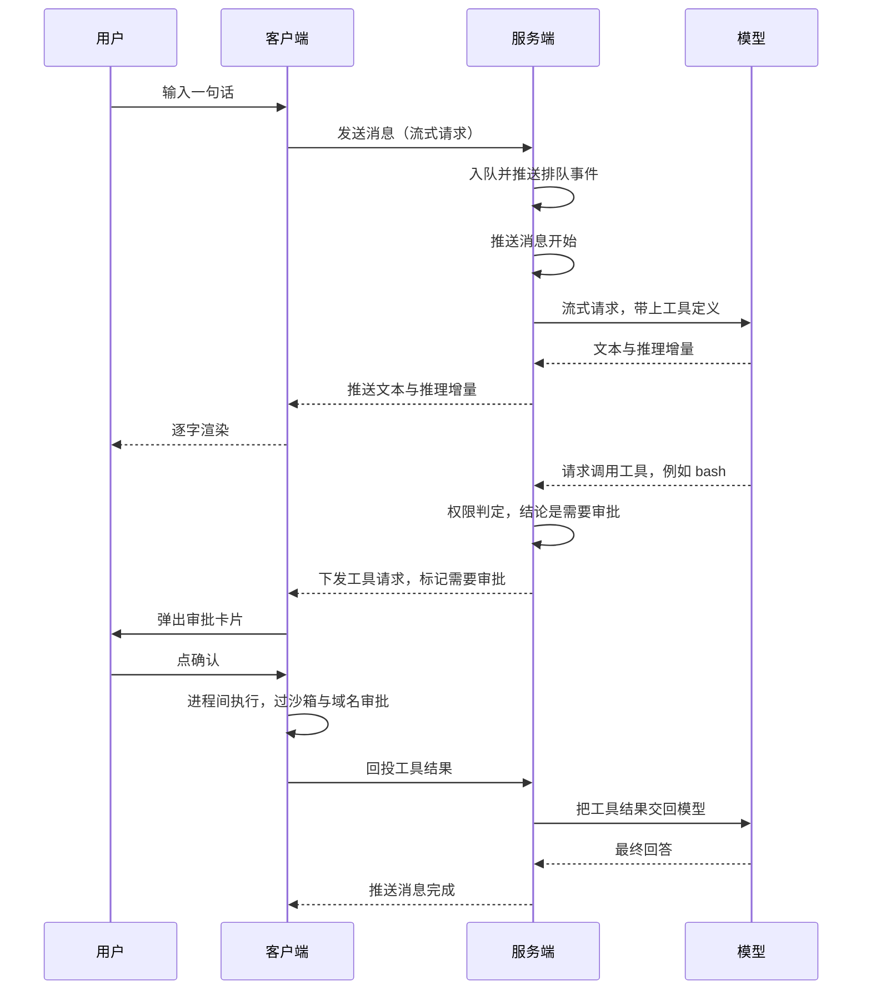

<h1 align="center">iWork</h1>

本工程采取C/S 模式开发，一句话概况「治理集中，执行本地」。需要统一管控的事情留在服务端，需要碰真实资源的事情放到用户机器上。判断标准是资源在哪儿 —— 你的代码、密钥、内网服务都在本地，让一个远端进程去直接读写它们既不安全也没必要；反过来，上下文、token 消耗、模型调用、审计这些需要集中治理的部分，一旦放到各人本地，就等于每个终端一套政策，管不住。

| | 服务端 | 客户端 |
|---|---|---|
| **角色** | 大脑 + 政策制定者 | 手 + 执行现场 |
| **负责** | Query Loop 编排、模型调用、上下文压缩、权限判定、会话持久化、审计与指标 | 对话界面、文件读写、shell 执行、MCP 子进程、沙箱、域名审批 |
| **不负责** | 不亲自执行文件与命令类工具，只判断该不该执行、要不要审批、要不要进沙箱，然后把决策下发 | 不调用模型、不管上下文与 token |

| Skill 中心 · Hub | MCP 中心 · Hub |
|---|---|
|  |  |

| 问答执行 | 专家团并行协作 |
|---|---|
|  |  |

## 一次完整交互

这条链路把 C/S 的分工讲全了：中间那次工具调用没有跨过进程边界，服务端只负责判断"这一步需要审批"，真正的执行与拦截都发生在客户端。

## 功能清单

| 模块 | 能做什么 |
|---|---|
| 会话与消息 | 1.…
