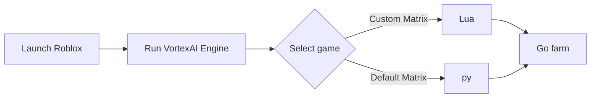

# ☄️ Roblox VortexAI-Helper App / Assistant / Open-Luau Automation / 4 Game

---

## ⚙️ Workflow Diagram

  
  </a>
  </a>

An open-source research environment for embedding and executing custom **Luau** scripts within interactive 3D engines. This toolkit provides a sandboxed execution runtime, event listening interfaces, and input state simulation for testing gameplay mechanics.

> **Disclaimer:** This project is designed strictly for educational research, game engine plugin development, and sandboxed script execution testing.

---

## 🛠 Features

Luau Script Workbench: Built-in editor with syntax highlighting, quick preset loading, and direct script execution simulation thread.

Spatial Telemetry & Radar: Real-time vector coordinate mapping, entity proximity scanning, and spatial diagnostic overlays.

Physics & Movement Simulation: Configurable velocity multipliers, jump parameters, and movement calibration helpers for Luau physics testing.

Modular…
