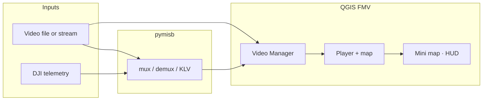

<h1 align="center">QGIS Full Motion Video</h1>

  <strong>Play MISB video. See telemetry on the map. Work in QGIS.</strong>

---

## What it does

QGIS FMV brings **Full Motion Video** into your GIS workspace: synchronized map layers (platform, footprint, sensor cone, trajectory), MISB/KLV metadata, drawing tools on video, mosaics, streams, and DJI → STANAG 4609 multiplexing.

Telemetry is handled by **[pymisb](https://pypi.org/project/pymisb/)** on PyPI. The plugin focuses on QGIS integration, playback, and geospatial visualization.

---

## Highlights

| Feature | What you get |
|---------|--------------|
| **Live map symbology** | Platform, footprint, beams, trajectory, frame center — updated with playback |
| **MISB / KLV** | Embedded metadata via pymisb; CSV/PDF export, ffprobe tree, bitrate plots |
| **Playback** |…
