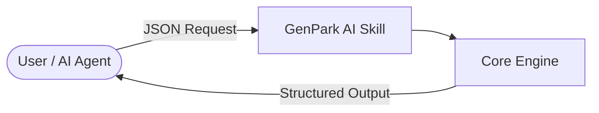

# genpark-agentic-micropayment-escrow-settlement-gateway-skill

   

> **GenPark AI Agent Skill** -- Agentic machine micropayment escrow settlement gateway (Stripe Agent Toolkit)

## Quick Start
```python
python example_usage.py
```

## Architecture


## MCP
```bash
python mcp_server.py
```
