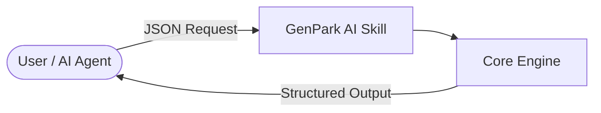

# genpark-autonomous-price-negotiation-discount-broker-skill

   

> **GenPark AI Agent Skill** -- Autonomous price negotiation discount broker & margin protection (Klarna AI)

## Quick Start
```python
python example_usage.py
```

## Architecture


## MCP
```bash
python mcp_server.py
```
