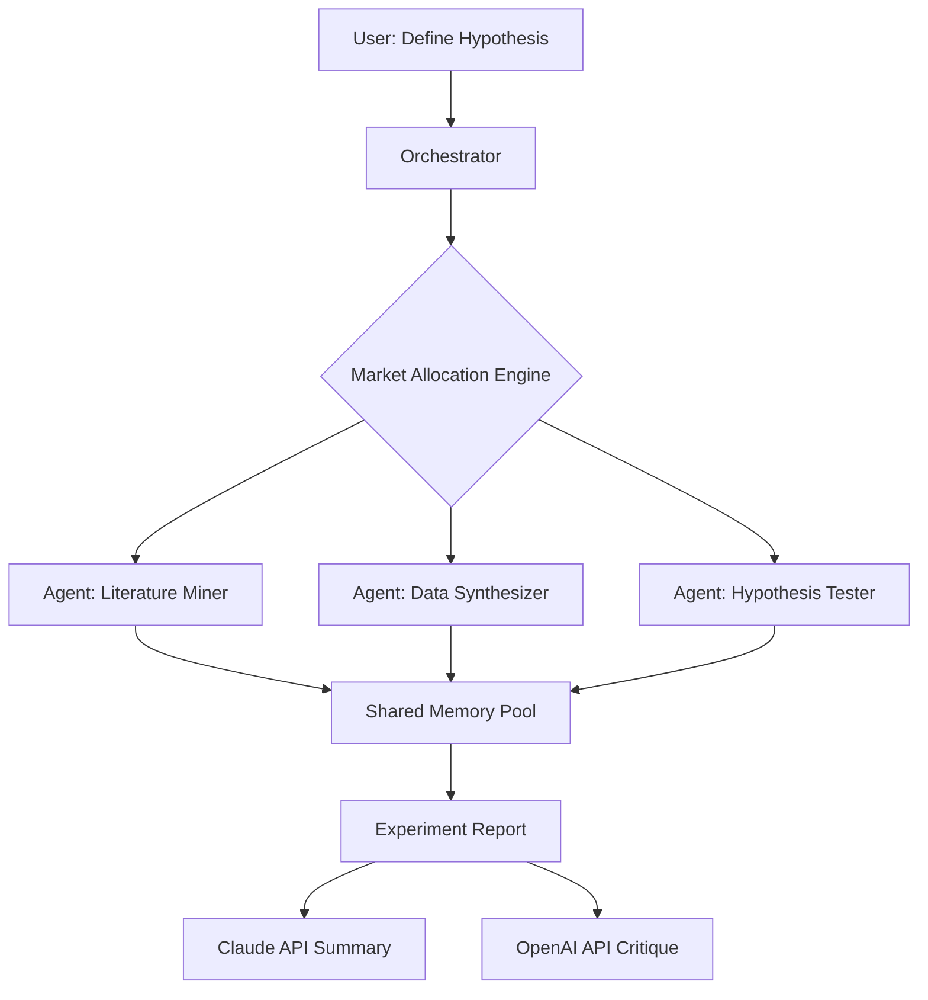

# 🧪 LabRat  
### Autonomous Multi-Agent Research Orchestrator

> **Turn your research chaos into a symphony of intelligent agents.**  
> LabRat is not an experiment tracker. It is a **self-organizing colony of AI research assistants** that autonomously explore hypotheses, allocate market-style computational credits, and produce reproducible findings—all coordinated through a single YAML configuration.

---

## 🧬 Overview

Imagine a research lab where every scientist is an AI agent, each with a unique specialization, budget, and communication protocol. LabRat orchestrates these agents using **market-based resource allocation**, where compute, API quota, and memory are traded like commodities.  

Your role? **Chief Scientist.** You define the experimental frontier; the colony navigates it.

---

## ✨ Feature…
