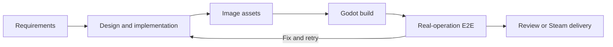

<h1>DeviLudo</h1>
  
<strong>AI-powered game development automation for Godot</strong>

  

    <strong>English</strong>
    ·
  

  

  

DeviLudo turns requirements and existing Godot projects into tested desktop builds and Steam-ready releases. Design, Development, and Test agents collaborate on the same project, generate image assets, build the game, operate it through native input, and preserve evidence for every iteration.

> [!IMPORTANT]
> DeviLudo is currently an MVP. The complete local workflow requires an Apple Silicon Mac. Cross-platform production validation uses separate Linux, Windows, and macOS E2E nodes.

## Core workflow

| Capability | What it provides |
| --- | --- |
| Specialized agents | Design, Development, and Test agents with separate roles and model settings |
| Existing-project support | Direct access to a local directory or a GitHub clone using the host's Git credentials |
| Iterative development | A…
