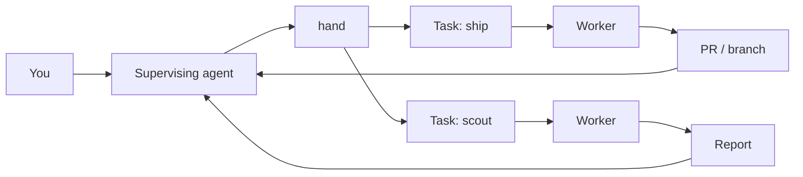

# Secondhand

**You lead. `hand` runs the crew.**

Secondhand turns one coding-agent session into a supervisor for a fleet of coding agents.

You talk to one agent. It plans the work, writes briefs, dispatches workers into isolated git worktrees, watches them, steers them when needed, and brings the results back to you.

`hand` is the CLI underneath that workflow. It owns lifecycle, state, isolation, and process supervision so the supervising agent can focus on judgment and coordination.

The canonical cross-cutting terms for this workflow are defined in [Hand orchestration vocabulary](https://github.com/atqamz/hand/blob/HEAD/docs/vocabulary.md).

Secondhand was inspired by [firstmate](https://github.com/kunchenguid/firstmate), rebuilding the same agent-fleet idea as a focused Go CLI.

## Why Secondhand?

Coding…
