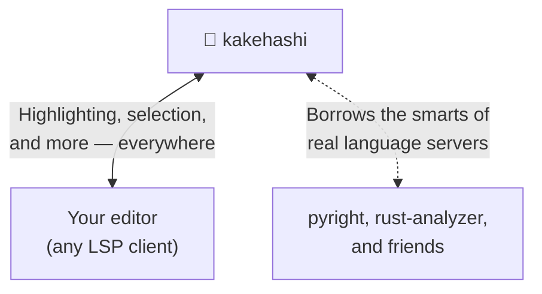

# 🌉 kakehashi (架け橋)

kakehashi is a bridge (架け橋) across your editors, your languages, and the language servers that make them smart.

- bridge to consistent syntax highlighting and smart selection — for any language with a Tree-sitter grammar
- bridge to your language servers' features — configured once in kakehashi, available in any editor
- bridge to all of the above — even for code embedded inside other code

## 🎨 Highlighting & smart selection, for any language

Open a file and kakehashi highlights it — consistently, in every editor. It parses with Tree-sitter, so any language with a grammar just works (that's hundreds of them), and it fetches the grammar it needs automatically the first time you open a file. No manual installs, no config to get started.

The same engine powers **smart selection**: grow or shrink your selection along the code's real structure, not just by lines and words.

Need a niche language, or want highlighting…
