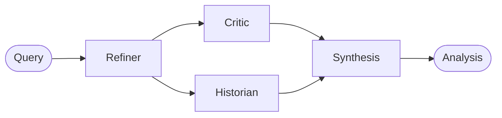

# CogniVault

**Multi-agent workflow orchestration for LLMs.** CogniVault runs your question through a four-agent analysis pipeline — refine, critique, contextualize, synthesize — on a LangGraph DAG with parallel execution, structured Pydantic outputs, full event observability, and an optional FastAPI/WebSocket service layer.

📖 **[Documentation →](https://aucontraire.github.io/cognivault/)** (Material for MkDocs, organized by [Diátaxis](https://diataxis.fr))

## How it works

- **Refiner** sharpens the raw query into an answerable question.
- **Critic** stress-tests it: assumptions, logical gaps, biases (in parallel).
- **Historian** retrieves relevant context via hybrid search — local markdown notes plus PostgreSQL full-text (in parallel).
- **Synthesis** integrates all perspectives into a final structured analysis.

Each agent returns a typed Pydantic model (validated against OpenAI structured-output strict mode), and every step emits correlated events for tracing and diagnostics.

## Features

- **LangGraph DAG…
