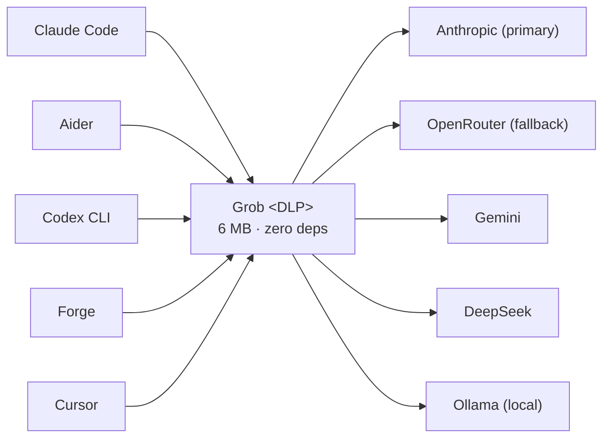

<h1 align="center">Grob</h1>
    <strong>Don't give your coding agents a blank check &mdash; on spend or on secrets.</strong>
  

    A Rust LLM control plane with inline DLP, routing, budgets, and signed audit logs.
  

  

---

**Grob** is a high-performance LLM control plane that sits between your AI tools and your providers. It redacts secrets before they reach the API, fails over transparently when a provider goes down, enforces budgets, records signed audit logs, and fits in a 6 MB container with zero dependencies.

> **~90 µs overhead** with DLP, routing, caching, and rate limiting all on the hot path -- sub-millisecond where LiteLLM sits in the milliseconds. Bare proxies post lower numbers by running none of these. [Full methodology and competitor table](https://github.com/azerozero/grob/blob/HEAD/docs/reference/benchmarks.md).

## Why…
