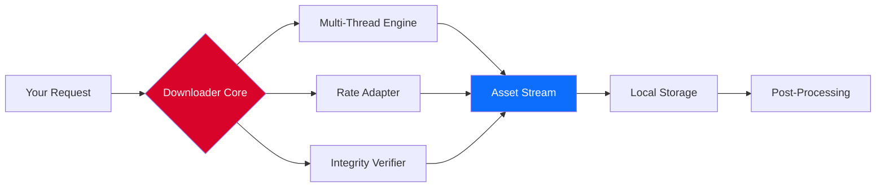

# 🚀 HTTP Downloader: Accelerated Asset Retrieval System

## 📥 Immediate Access (Latest Stable Build)

Your journey to streamlined digital asset retrieval begins here. This release represents the culmination of years of protocol optimization—engineered for those who demand speed without compromise.

## 🔄 Table of Contents

- [Core Philosophy](#-core-philosophy)
- [Why This Exists](#-why-this-exists)
- [Feature Ecosystem](#-feature-ecosystem)
- [Architecture Deep Dive](#-architecture-deep-dive)
- [Quick Start Configuration](#-quick-start-configuration)
- [Example Console Invocation](#-example-console-invocation)
- [Integrations](#-integrations)
- [Compatibility Matrix](#-compatibility-matrix)
- [Performance Benchmarks](#-performance-benchmarks)
- [Frequently Asked Questions](#-frequently-asked-questions)
- [Disclaimer & Legal…
