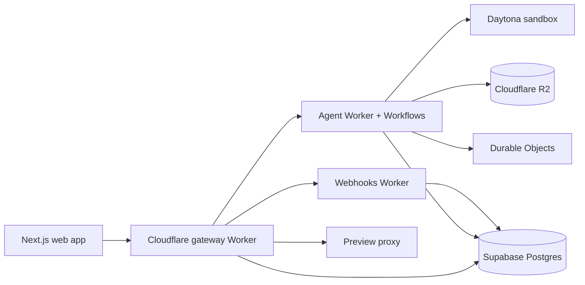

# Cheatcode

Cheatcode is a source-available generalist AI agent platform. Give it an
outcome—not a sequence of tool calls—and it can build applications, create
documents and media, research the live web, and operate browser workflows in an
isolated workspace.

The project is built for people who want an inspectable, self-hostable agent
stack without surrendering provider choice. Users bring their own model keys;
the platform keeps long-running work, browser execution, files, generated
outputs, and tenant data behind explicit boundaries.

## Architecture

- Next.js 16 and React 19 provide the product UI.
- Cloudflare Workers, Workflows, and Durable Objects own admission, execution,
  webhooks, and streaming.
- Daytona supplies one isolated workspace and browser runtime per project.
- Supabase…
