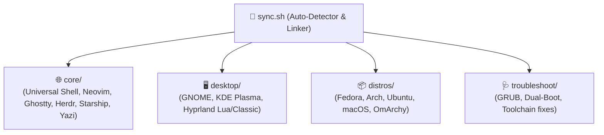

# 🚀 archConfig

A unified, modular, cross-distribution dotfiles and bootstrap system. Designed to deliver an identical, high-performance developer workflow across **Fedora**, **Arch Linux**, **Ubuntu**, **macOS**, and **OmArchy** without configuration fragmentation.

---

## 🏗️ Layered Architecture

The repository separates universal developer tooling from desktop environments, distro-specific package installers, and troubleshooting runbooks:

| Layer | Directory | Purpose |
| :--- | :--- | :--- |
| **Core Configs** | [`core/config/`](https://github.com/Codesmith28/archConfig/blob/HEAD/file:///home/codesmith28/archConfig/core/config) | Universal application configurations (`nvim`, `ghostty`, `herdr`, `leaf`,…
