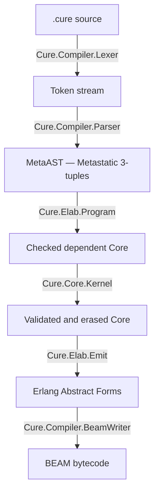

# Cure

Dependently-typed programming language for the BEAM virtual machine with
one kernel-checked compiler pipeline and first-class OTP concurrency.

Cure compiles `.cure` source files to BEAM bytecode, enabling programs to run
natively on the Erlang VM alongside Erlang and Elixir code.

## Architecture



Every pipeline stage emits structured events via `Cure.Pipeline.Events`,
backed by an Elixir `Registry` in PubSub mode. External tools (LSP, profilers,
IDE plugins) can subscribe to observe and react to compilation in real time.

## Internal Representation

Cure uses [Metastatic](https://hexdocs.pm/metastatic)'s MetaAST 3-tuple
format as its internal AST:

```elixir
{type_atom, keyword_meta, children_or_value}
```

This provides a well-defined, layered AST structure and interoperability with
Metastatic's…
