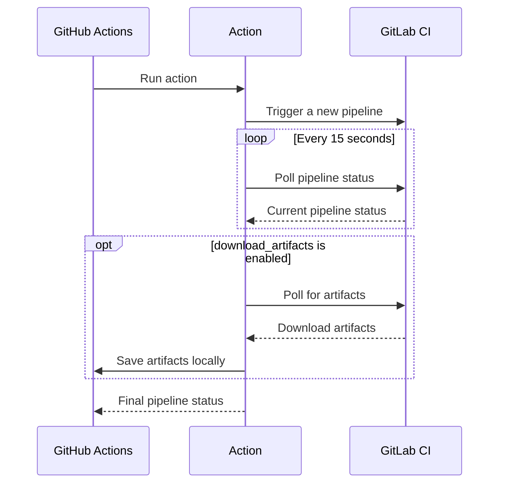

# GitLab Pipeline trigger action

[GitHub](https://github.com/digital-blueprint/gitlab-pipeline-trigger-action) |
[GitHub Marketplace](https://github.com/marketplace/actions/gitlab-pipeline-trigger)

This GitHub action triggers and waits for a [GitLab pipeline](https://docs.gitlab.com/ee/ci/pipelines/) to complete.

You can for example use this action in your GitHub workflow to trigger a deployment pipeline on a private
GitLab server after a successful build pipeline and wait for the deployment (with possible End2End tests)
to finish, so you would get a notification if the deployment failed.

## Inputs

### `host`

The GitLab…
