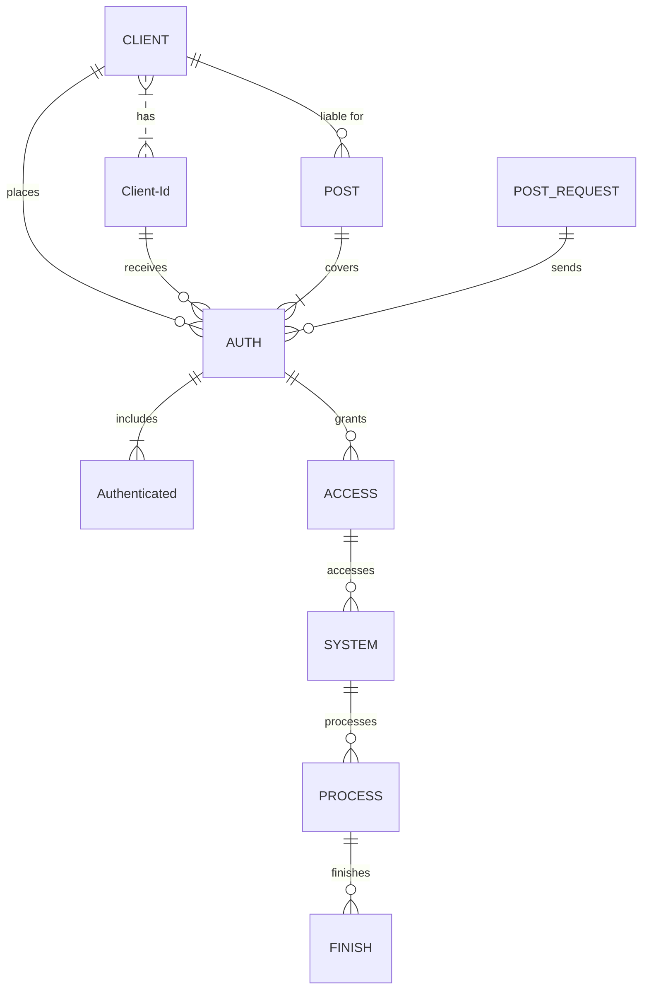

## EN

## README LANGUAGE

    LANGUAGES!
  
---------------------------------  
  

### **PLEASE READ FIRST WHAT YOU NEED PART.**
#### 
(<a href="#what-you-need-1">WHAT YOU NEED</a>)
 

https://github.com/prosdsdffr/asd14141/assets/170769680/0f66eb04-f5db-4837-9a15-11627ccf4422

### What You Need
----
                    
| Needed      | Base64 |
| --------- | -----:|
| Last Game Seed  | 0000 |
| Hash     |   Daf |
| Last Game Id      |    000 |
| Token |    ST8 |
| Stake Id |    91 |
                
----

## Roadmap

- [ ] New Gui
- [x] Add back to top links
- [ ] Add Additional Templates w/ Examples
- [ ] New Features
- [x] Multi-language Support
    - [x] Chinese
    - [x] Turkish
    - [x] French
    - [x] Spanish

## Getting Started

###…
