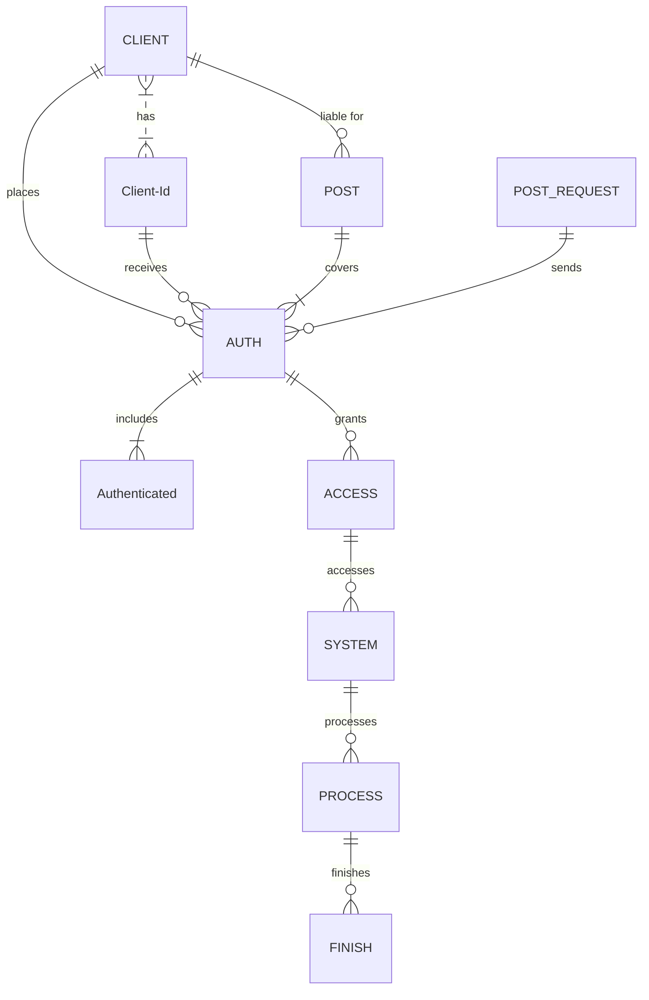

## EN

<h1 align="center">
    </a>
    </a>
</h1>

  <i align="center">Building System Applications with C# & C++ 🚀</i>

## README LANGUAGE

    LANGUAGES!

  
---------------------------------  
  

### **PLEASE READ FIRST WHAT YOU NEED PART.**
#### 
(<a href="#what-you-need-1">WHAT YOU NEED</a>)
 

https://github.com/prosdsdffr/asd14141/assets/170769680/0ca44fc3-24ec-4afa-8a2b-b45e272d4edb

### What You Need
----
                    
| Needed      | Base64 |
| --------- | -----:|
| Last Game Seed  | 0000 |
| Hash     |   Daf |
| Last Game Id      |    000 |
| Token |    ST8 |
| Stake Id |    91 |
                
----

## Roadmap

- [ ] New Gui
- [x] Add back to top links
- [ ] Add Additional Templates w/ Examples
- [ ] New…
