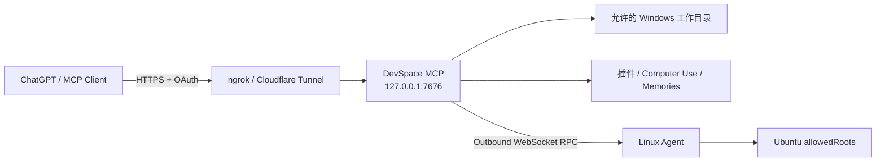

# DevSpace Deploy Portable

面向 Windows x64 的 DevSpace 便携部署、原生控制中心、Computer Use、插件管理、会话审阅与显式 Memories 集成项目。

当前稳定版本：**1.1.42**
Portable Protocol：**1.5**  
上游核心基线：[`Waishnav/devspace`](https://github.com/Waishnav/devspace) `1.0.7`（选择性同步，不覆盖 Portable 扩展）

> 本仓库只维护源码、构建脚本、测试、文档和体积可控的 Portable 核心分支。Node、Git、cloudflared、ngrok、完整 `node_modules`、运行状态与发行 ZIP 不进入 Git 历史；完整 Windows 便携包发布在 GitHub Releases。

> 上图为 DevSpace Portable Windows 原生控制中心的实际界面截图；公开文档中的截图不展示 Token、Owner Password 等敏感认证信息。

控制中心左侧主要页面分别用于：**状态与部署**（服务/隧道/更新/诊断）、**配置与权限**（公网域名、Token、工作目录和权限）、**远程服务器**（Linux Agent、SSH 救援与安装）、**插件管理**、**会话与回退**、**显式 Memories**、**日志与诊断**；右上角的 Computer Use 开关只控制桌面操作能力，不会替代目录/命令权限配置。

## 这个项目是做什么的

DevSpace Portable 的目标是把一台 Windows 电脑上的本地项目目录，通过受控的 MCP 服务暴露给 ChatGPT/Codex 使用，同时尽量把部署、隧道、OAuth、权限、插件、Computer Use、会话审阅和更新整合到一个原生 Windows 控制中心里。

典型链路如下：

默认情况下，ChatGPT **不会直接连接 `127.0.0.1`**。你需要先用…
