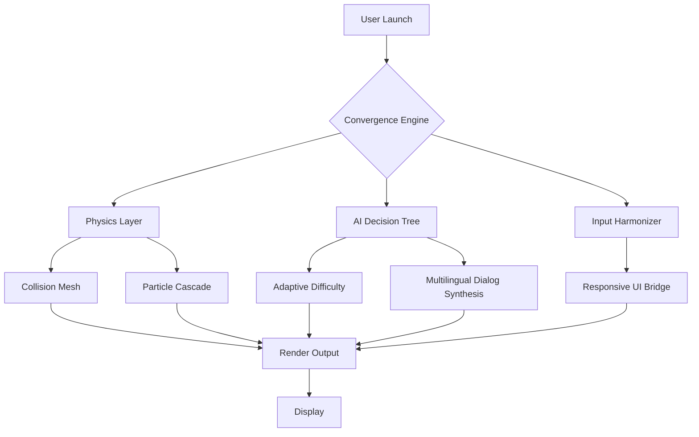

# Invincible: VS — The Convergence Engine (Desktop Edition)

> **Unleash the arena.** A desktop-native combat simulation where every punch echoes through the multiverse. Not a game—a convergence engine.

---

## 🌌 Overview

*Invincible: VS* is not merely a fighting game. It is a **desktop-native combat convergence engine** designed for the 2026 generation of PC hardware. This repository represents the official release build for Windows, macOS, and Linux—delivering frame-perfect responsiveness, multi-threaded particle physics, and a narrative layer that adapts to every clash.

We have built this for the fan who demands **zero compromise**: no cloud dependency, no subscription, no telemetry. Just raw, local, scalable combat simulation.

---

## 🎯 Key Features

-…
