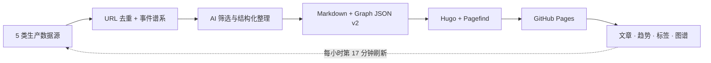

<h1>AI Stack · AI 史塔克</h1>

<strong>AI 情报长期档案与动态场景知识图谱</strong>

从多源采集、历史去重、AI 精炼，到文章归档、趋势洞察、图谱探索与自动发布，一个仓库跑通最小闭环。

<em>From AI firehose to a living knowledge graph.</em>

  ·
  ·
  ·
  ·

</a>

## ⚡ 为什么是 AI Stack

| ⚙️ 一仓闭环 | 🧭 长期可追溯 |
| --- | --- |
| **采集 → 精炼 → 归档 → 发布** 全部在一个仓库完成，不依赖数据库、消息队列或常驻服务；最小系统也能独立运行。 | 先按 URL 去重，再用有限来源证据识别跨 URL 的转载、衍生与同事件观察；原始来源和谱系关系都可回查。 |
| 
<strong>📈 可解释趋势</strong>
 | 
<strong>🕸️ 活的知识图谱</strong>
 |
| 用证据数量、增长、加速度、来源多样性与新颖度识别信号，可从排名下钻到文章证据。 | 以“技术总览 → 标签社区 → 节点邻域”渐进探索，只加载当前需要的子图。 |

> [!IMPORTANT]
> 公开仓库使用标准 GitHub-hosted runner 与 GitHub Pages 时，托管和调度的固定基础设施成本可以接近 **0**。模型 API 与可选自定义域名可能产生外部费用；只浏览线上站点或本地启动 UI 不需要模型密钥。

## 🔁 最小闭环，几乎零基础设施成本

AI Stack 把一个容易失控的情报工程压缩成可版本化的静态闭环：内容是 Markdown，关系是 Graph JSON v2，检索由 Pagefind 生成，发布目标是 GitHub Pages。

| 使用方式 | 需要什么 | 成本边界 |
| --- | --- | --- |
| 🌐 在线浏览 | 浏览器 | 无需账户、无需密钥 |
| 💻 本地启动 UI…
