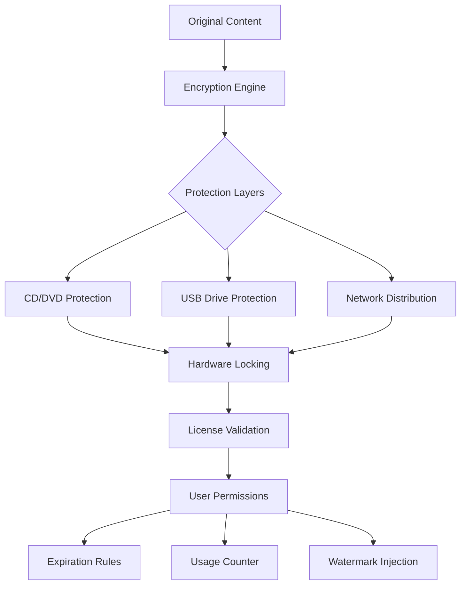

# 🛡️ Gilisoft Copy Protect 12.3.3 – Digital Fortress for Your Intellectual Property

**Version:** 12.3.3 | **Release Year:** 2026 | **License:** MIT

---

## 🚀 Instant Access

*One command, zero friction – your digital vault awaits.*

---

## 📊 Architecture Overview

---

## 🌟 What Makes This Edition Unique

In 2026, the digital landscape demands more than simple encryption – it requires a **living fortress** that breathes with your business needs. Gilisoft Copy Protect 12.3.3 isn't merely a software shield; it's a **sentient guardian** for your creative works. Imagine pouring months into a training video, a software application, or a digital art collection – only to have it replicated in seconds by anyone with a screen recorder. This version eliminates that nightmare by…
