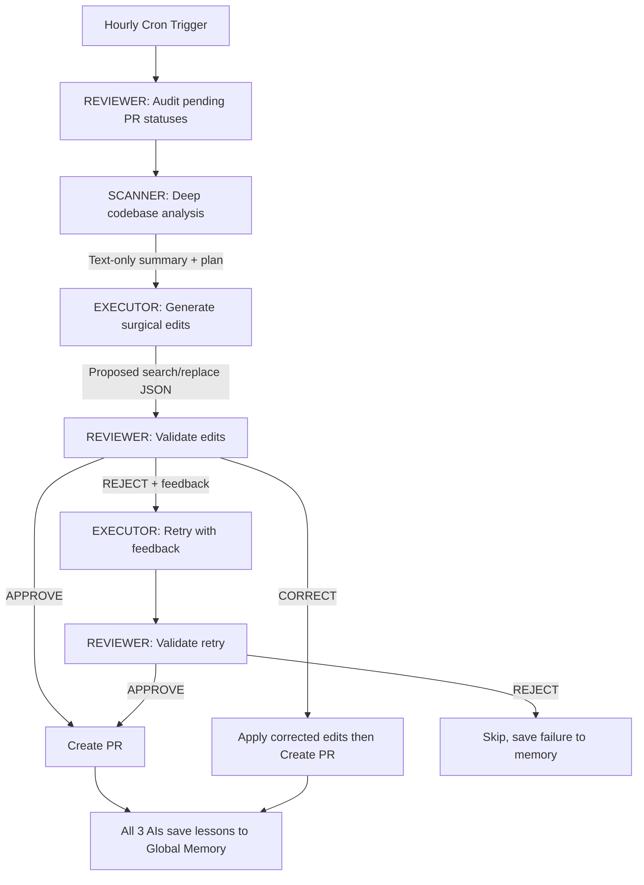

# Mayo 🦾🤖
### The Autonomous Triple-AI Maintainer

Mayo is a **Self-Improving Autonomous Maintenance Engine** integrated directly into your GitHub ecosystem. It uses a **Triple-AI Pipeline** — three specialized AI models working in concert — to produce high-value, validated code improvements across all your repositories.

---

## 🧬 Triple-AI Pipeline

Every improvement goes through 3 AI models before it becomes a PR:

| Role | Model(s) Used | Purpose |
|---|---|---|
| 🔭 **Scanner** | Fireworks AI (Llama 3.3 70B), Gemini 2.5…
