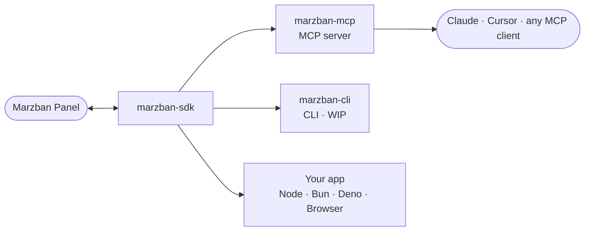

# MarzbanSDK

**A TypeScript toolkit for the [Marzban](https://github.com/Gozargah/Marzban) API.**

[**Documentation**](https://ilmar7786.github.io/marzban-sdk) · [**SDK**](https://github.com/Ilmar7786/marzban-sdk/blob/HEAD/packages/sdk) · [**MCP Server**](https://github.com/Ilmar7786/marzban-sdk/blob/HEAD/packages/mcp)

---

One TypeScript SDK for Marzban, and everything built on top of it. Fix a
bug or add an endpoint in the SDK, and the MCP server, the CLI, and every app
built on it get it for free.

## How it fits together

The SDK talks to your Marzban panel. The MCP server and CLI are just clients
of that same SDK — same auth, same retries, same typed errors — so they never
drift from each other or from your own code.

## Packages

| Package                          | npm                                                        | Docker…
