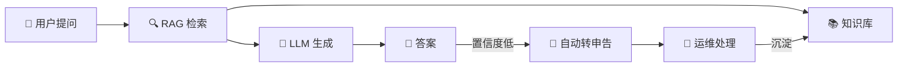
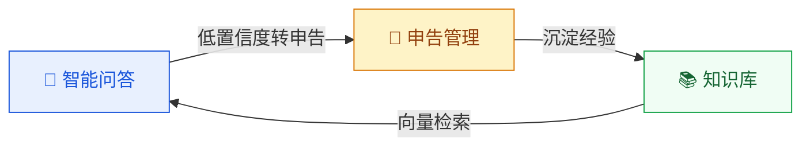

</p>

<h1 align="center">OpsMind</h1>

</p>

---

## 这是什么？

企业运维团队每天被重复性咨询淹没——密码重置、权限申请、系统报障。这些工作消耗运维人员 40% 以上的时间，却无法沉淀为可复用的知识。

OpsMind 不是另一个 ChatGPT 套壳。它是一个**从检索管道到业务流程都自建**的运维数字员工系统：

- **自建 RAG 引擎** — BM25 + 向量混合检索 + RRF 融合 + 重排序，全程可控可审计
- **知识资产化** — 每次问答、每条申告处理记录都可转化为知识库文章，审核后发布
- **数据不出域** — 全部存储在自有 PostgreSQL + pgvector，支持本地 llama.cpp 推理



## 核心能力



| 🧠 智能问答 | 📚 知识管理 | 🎫 申告管理 | 🔐 权限看板 |
|:---|:---|:---|:---|
| 自建 7 步 RAG 管道 | 手动录入 / 文档上传 | 完整状态机流转 | JWT 双令牌 + RBAC |
| SSE 流式逐 token 输出 | 草稿→审核→发布→停用 | 站内消息实时通知 | 4 个预设角色，菜单动态渲染 |
| 失败自动降级，不中断 | 发布自动向量化到 pgvector | 7 天无操作自动关闭 | 实时统计卡片 + 趋势图 |
| 多轮对话 + 会话管理 | 支持 PDF · DOCX · MD · TXT | 处理记录 → 知识候选 | 敏感操作全量审计日志 |

## 架构

```mermaid
graph TB…
