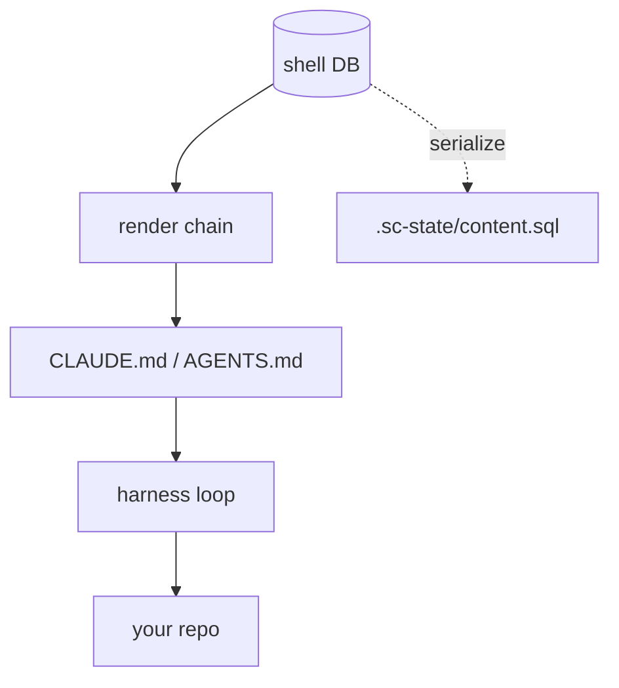

---
title: super-coder
tags: [substrate, shells, agentic-coding, harness-agnostic, sqlite]
date: 2026-06-14
project: super-coder
purpose: Forkable shell substrate for a repo
---

# super-coder

## Overview

A **forkable shell substrate for a single code repository.** You install it into
a project repo; it brings the shell system — DB-backed identity, memory, seed/L&S,
decisions, flags, a roadmap, and spec/doc content — and runs that repo through
whatever coding harness you point at it — **Claude Code, OpenCode, Codex, and
Mistral Vibe**, all sandbox-integrated (or run on the no-docker host path).

The bet: **we build the data layer, we rent the harness.** The agent loop, the
tools, the model API are the harness's job. We own identity + memory + content
and render a boot artifact the harness reads natively.

This repo is also **dogfood**: super-coder maintains super-coder. Its own
`.super-coder/` engine manages the maintainer shell…
