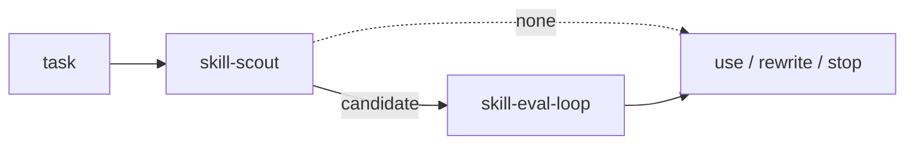

# tink-skills

Scout what fits. Measure if it moves anything.

Local evidence under project `.agents/skills/` — not a claim the skill wins
everywhere. Install with [tink](https://github.com/jon-devlapaz/tink).



## Install

```console
# Tink 1.0.0 at the reviewed release-candidate commit.
cargo install --git https://github.com/jon-devlapaz/tink.git \
  --rev 2b082b5032b6f6cef6ea301868c499a93b86552f --locked

tink init --with-tink-skills
tink skill list
tink skill check
```

One skill at a time:

```console
tink skill add jon-devlapaz/tink-skills --skill skill-scout
tink skill add jon-devlapaz/tink-skills --skill skill-eval-loop
tink skill add jon-devlapaz/tink-skills --skill triangulate-me
```

Refresh every clean GitHub import:

```console
tink skill refresh
```

Refresh one by naming it: `tink skill refresh NAME`.

Local skills do not refresh. Install a library skill by name with
`tink skill add NAME`. Do not hand-edit `.tink-source.json` receipts.

## First success

Start with the core loop: scout a candidate, then…
