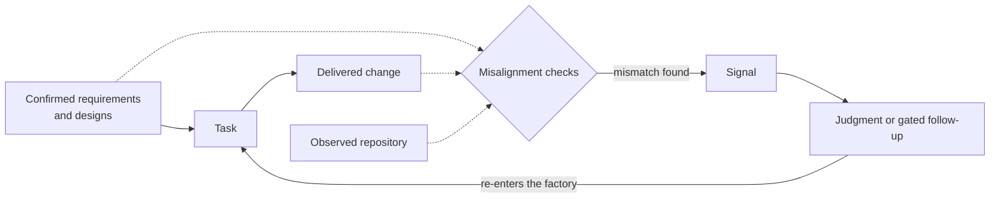

# Conveyor

Coding agents can produce changes faster than a team can review them. The
harder question is whether those changes match what the team intended to build.

Conveyor gives that work a defined process. Humans confirm requirements,
system designs, and decisions. Agents use those documents to plan, implement,
and review tasks on your machines, with human approval where required.

Requirements traceability gives reviewers a basis for checking the work and
identifying where it has drifted from the agreed intent.

Conveyor has used this process to build itself since July 2026.

## The knowledge graph

Conveyor links each change to the documents, task, review, and test evidence
behind it.

Conveyor checks each delivery against confirmed requirements and governing
designs. When…
