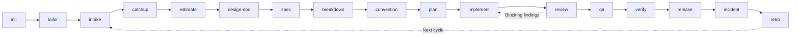

# AI Team Kit (`atk`)

Twenty-one skills covering the software delivery lifecycle of a **company project team**. Every skill
assumes work has an author and a separate reviewer, decisions have an owner, and artifacts are read
by someone who was not in the conversation that produced them. Those are roles rather than a
headcount: a solo developer holding all of them gets the same gates, and still approves by hand.

Compatible with Claude Code, Cursor, and OpenAI Codex CLI.

Walkthrough of what each skill means and when to use it:
[docs/skills-overview.md](https://github.com/lamngockhuong/aiteamkit/blob/HEAD/docs/skills-overview.md) (English) /
[docs/vi/skills-overview.md](https://github.com/lamngockhuong/aiteamkit/blob/HEAD/docs/vi/skills-overview.md) (Tiếng Việt).

## Lifecycle

Three skills…
