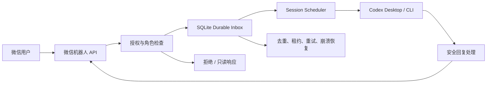

# Weixin Codex Bridge

一个将微信消息安全转发到本地 Codex Desktop 或 Codex CLI 的独立桥接器。

适合想通过微信触发个人 Codex 工作流，又需要用户授权、会话隔离、沙箱限制、消息持久化和本地数据控制的用户。

> **重要说明：** 微信消息属于外部不可信输入。项目默认拒绝未授权用户，默认关闭高权限 Codex 参数和本地控制台。但使用者仍需为 Codex 配置独立工作目录，并理解本地自动执行带来的风险。

---

English: [README.en.md](https://github.com/leilong611-ai/weixin-codex-bridge/blob/HEAD/README.en.md)

---

## 项目解决什么问题

Codex 通常运行在电脑本地，而高频沟通入口往往在微信中。

本项目在两者之间建立一个边界明确的桥接层：

- 从已登录的微信机器人账号读取消息
- 对微信用户进行白名单和角色鉴权
- 为不同微信会话建立隔离的本地 session
- 将允许的文本消息交给 Codex Desktop 或 Codex CLI
- 将执行结果安全回复到微信
- 使用 SQLite 持久队列避免消息因程序重启而静默丢失
- 对控制台、日志、工作目录和本地数据实施默认安全限制

## 架构

**信任边界：**

| 边界 | 信任等级 |
|------|----------|
| 微信用户 | **不可信** — 需要授权检查 |
| 微信消息 | **不可信** — 外部输入 |
| Codex 输出 | **可能含敏感内容** — 需脱敏 |
| SQLite 数据 | 只保存于本地私有状态目录，定期清理 |

## 默认安全策略

项目采用默认拒绝和最小权限原则：

| 能力 | 默认状态 |
|------|----------|
| 未授权微信用户 | 拒绝 |
| `--full-auto` | 关闭 |
| `--skip-git-repo-check` | 关闭 |
| 本地控制台 | 关闭 |
| 完整 transcript | 关闭 |
|…
