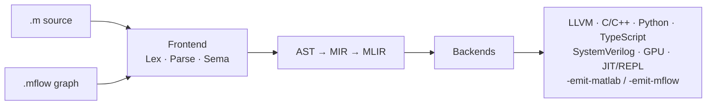

# matlab_llvm

&nbsp;
&nbsp;

A self-contained **MATLAB compiler and tooling stack** for a practical,
tested subset of the language — one frontend feeding many backends, plus a
JIT-backed REPL, a debugger (DAP), a formatter, and a Language Server.

No MathWorks source, no Octave, no BLAS/LAPACK dependency for the compiled
backends. C++20 frontend, MLIR-based lowering, in-tree C / Python / TypeScript
runtimes.

## Pipeline

Both frontends produce the same `TranslationUnit`; two reverse emitters round-trip
any input back to canonical `.m` (`-emit-matlab`) or an IDE `.mflow` diagram
(`-emit-mflow`). Architecture detail: [§ Architecture](#architecture).

## Code Generation

| Target | Flag | Notes |
|---|---|---|
| LLVM IR / native | `-emit-llvm` | primary path; JIT also drives the REPL/DAP |
| C / C++ | `-emit-c` / `-emit-cpp` | self-contained source + in-tree runtime |
| Python / TypeScript |…
