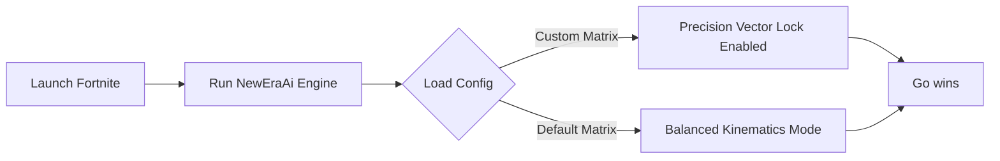

# Fortnite-NewEra-AI-Assistant — Advanced AI Training Platform & Vision Assistant

  
  </a>
  </a>

## ⚙️ Workflow Diagram

## 1. Dynamic Model Recognition (Visual Assistance)
Instead of interacting with game memory (Internal), the engine uses an External Pixel-Analysis Pipeline to identify distinct geometric shapes, character player models (Skins), and build structures unique to Fortnite's art style.

Low-Latency Input Alignment Vector (Dynamic Tracking) Calculates the spatial discrepancy between the user's current camera vector and the detected target matrix. * **Humanized Smoothing:** Uses advanced Bezier curve interpolation to prevent robotic movements, emulating organic human input. * **FOV (Field of View) Zoning:** Allows users to define a strict pixel radius ($R_{fov}$) for tracking activation to prevent erratic shifts during rapid build-fights.

## 2. Tactical Spatial Overlay (Augmented…
