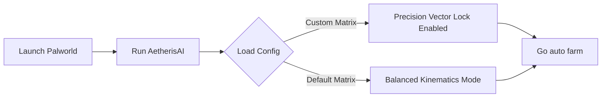

# 🌟 AetherisAI — Palworld Auto Farm &  Radar / 

---
  </a>
---

  
  </a>
  </a>

## ⚙️ Workflow Diagram

---

# 🌟 Core Modules & Capabilities

🥚 Incubator & Breeding Automation

Instant Hatch Hooking: Overrides incubator countdown timers and environmental warmth/cooling parameters directly via PalIncubator object arrays.

✨ Spatial Telemetry & Radar Array

500m Target Scanner: High-refresh 2D radar mapping active trajectory points for Lucky/Shiny Pals, Legendary Bosses (e.g., Jetragon, Frostallion), and Palpagos Island dungeon entrances.

💎 Resource & Inventory Management

Gravity Drop Magnet: Pulls dropped Paldium, Coal, and Ore instances directly to player coordinates (APalPlayerCharacter).

Weight Capacity Adjuster: Calibrates local weight limits for heavy resource transportation and base expansion.

⚡ Base Camp & Pal Sanity Monitor

SAN & Productivity Sync: Restores assigned base Pal Sanity and work…
