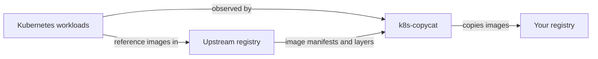

# k8s-copycat

k8s-copycat watches the container images referenced by Kubernetes workloads and copies them into a registry you control. It keeps a mirror of your runtime dependencies in AWS ECR or another Docker-compatible registry, without changing your workloads.

[Quick start](#quick-start) · [Configuration](#configuration-reference) · [Example configuration](#example-configuration) · [Troubleshooting](#observability-and-troubleshooting) · [Optional Kyverno use case](#use-case-copycat--kyverno-image-replacement)

## What does it do?

An upstream image can disappear, a tag can be deleted or changed, and a public registry can become unavailable, overloaded, or rate-limited. k8s-copycat provides an insurance policy: preserve the images your cluster uses while they are still available, so you have your own copy when you need it.

The controller watches **Deployments, StatefulSets, DaemonSets, Jobs, CronJobs, and Pods**, including regular, init, and ephemeral…
