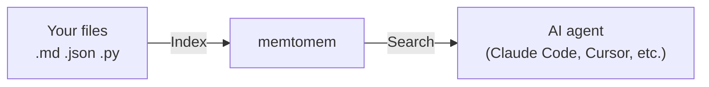

# memtomem

> Markdown-first long-term memory for AI coding agents — your data, your quota, no hooks.

> 🚧 **Alpha** — APIs, defaults, and on-disk config surfaces may still change between `0.x` releases. Feedback and issue reports are especially welcome: [Issues](https://github.com/memtomem/memtomem/issues) · [Discussions](https://github.com/memtomem/memtomem/discussions).

memtomem turns your markdown notes, documents, and code into a searchable knowledge base that any AI coding agent can use. Write notes as plain `.md` files — memtomem indexes them and makes them searchable by both keywords and meaning.

> **First time here?** Follow the [Getting Started](docs/guides/getting-started.md) guide — you'll have a working setup in under 5 minutes.

---

## Why memtomem?

| Problem | How memtomem solves it |
|---------|------------------------|
| AI forgets everything between sessions | Index your notes once, search them in every session |
| Keyword search misses related content | Hybrid search: exact keywords + meaning-based…
