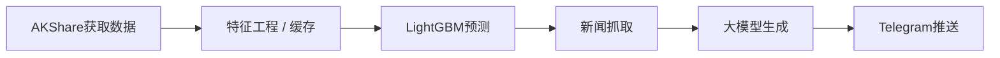

# llm_stock_report

**AI + 传统量化双驱动：** 不是单纯的 LLM 闲聊，而是基于 LightGBM 的客观预测辅助。  
**AI + Quant Dual Engine:** This is not pure LLM chatting; it is grounded by objective LightGBM-based prediction signals.  
**开箱即用的自动化：** 内置完整的 GitHub Actions 工作流，无需服务器即可白嫖算力。  
**Automation Out of the Box:** Built-in end-to-end GitHub Actions workflows, so you can run it without maintaining your own server.  
**支持本地/私有化部署：** 全面兼容本地大语言模型，零 API 成本运行。  
**Local / Private Deployment Ready:** Fully compatible with local LLMs for zero API-cost operation.  

LLM daily stock summary + next-day prediction for CN/US/HK markets, with scheduled GitHub Actions and Telegram delivery.

简体中文 | [English](#english)

- 中文完整使用文档: [docs/full-guide.md](docs/full-guide.md)
- English full guide: [docs/full-guide_EN.md](docs/full-guide_EN.md)
- GitHub Actions 配置手册（中文）: [docs/github-actions-setup.md](docs/github-actions-setup.md)
- GitHub Actions setup guide (EN): [docs/github-actions-setup_EN.md](docs/github-actions-setup_EN.md)

## Pipeline

## 中文

### 推送预览

### 项目功能
- A股使用…
