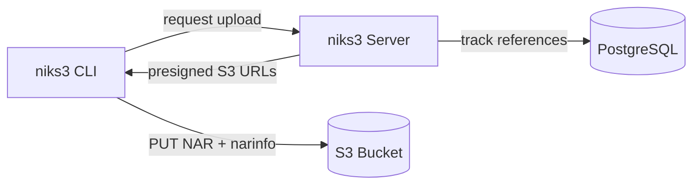
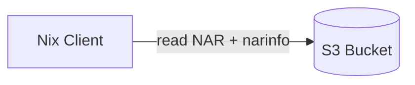

# S3-backed Nix binary cache with garbage collection

The idea is to have all reads be handled by the s3 cache (which itself can be high-available)
and have a gc server that tracks all uploads to the cache and runs periodic garbage collection on s3 cache.
Since writes to a binary cache are often not as critical as reads,
we can vastly simplify the operational complexity of the GC server, i.e. only
running one instance next to the CI infrastructure.

## Architecture

### Write path

The niks3 CLI requests an upload from the server, which returns pre-signed S3 URLs.
The client uploads NAR files and narinfo directly to S3.
The server tracks references in PostgreSQL for garbage collection.

### Read path

Nix clients read directly from S3 (or a CDN in front of it) without going through niks3.
This allows the read path to scale independently and remain highly…
