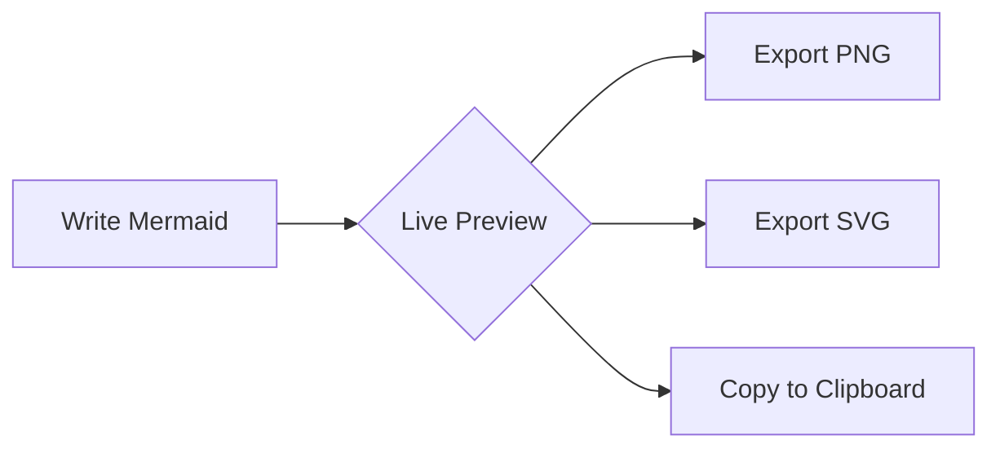

# Nereid

### Mermaid Diagrams for JetBrains IDEs

*A full-featured, free, and open-source Mermaid diagramming plugin for all JetBrains IDEs.*

[Getting Started](#-getting-started) | [Features](#-features) | [Installation](#-installation) | [Contributing](#-contributing)

---

## About

**Nereid** brings the full power of [Mermaid.js](https://mermaid.js.org/) to your JetBrains IDE with live preview, syntax highlighting, code completion, and export capabilities. Create beautiful diagrams without leaving your editor.

---

## 🚀 Getting Started

1. Install from **Settings** → **Plugins** → **Marketplace** → Search "Nereid"
2. Create a new file with `.mmd` extension
3. Start typing your diagram and watch it render in real-time!

---

## ✨ Features

### Editor
| Feature | Description |
|---------|-------------|
| **Live Preview** | Real-time rendering with configurable debounce delay |
| **Split View** | Editor-only, split, or preview-only modes |
| **Syntax Highlighting** | Full highlighting for all Mermaid syntax |
| **Code…
