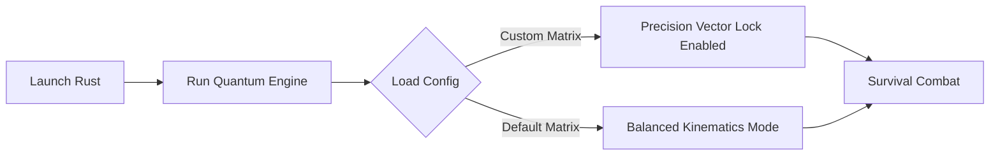

> **Legal & Educational Disclaimer:** *This repository is maintained strictly for academic research, human-computer interaction analysis, and system accessibility purposes. It does not manipulate game memory, alter internal game files, or inject unauthorized code into any active game client. Users are responsible for complying with local platform End User License Agreements (EULA).*

---

## ⚙️ Workflow Diagram

# Rust-Quantum-v2-Next-Gen-AI-Assistant — Advanced AI Training Platform & Vision Assistant

  
  </a>
  </a>

---

**Rust-Quantum-v2-Next-Gen-AI-Assistant** is a cutting-edge, external training utility and visual guidance platform engineered for dynamic multiplayer survival environments. Utilizing local neural networks and real-time computer vision models, the system analyzes desktop pixel streams to enhance situational awareness, tactical reaction matrices, and crosshair alignment. By…
