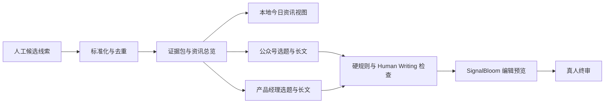

# SignalBloom

> 从信息噪声中找到可信信号，再把它生长成可审核、可分发的内容。

SignalBloom 是一个以 Codex Harness 为执行内核的 AI 行业内容工作流 MVP。它将候选信息整理、去重、事实核验、平台选题、长文写作、配图和质检拆成可追踪阶段，最终交付投稿前编辑包。

当前版本不会登录、写入或发布到微信公众号和人人都是产品经理。终稿仍由真人编辑判断是否发布。

## 现在能做什么

- 读取人工策展的每日候选线索。
- 规范化 URL，聚合重复事件，按来源层级与时效排序。
- 生成资讯总览、事实主张、证据链接和双平台选题。
- 在本地 `review.html` 中提供“今日资讯”视图，按重要度展示本次入选资讯、产品影响、风险边界、证据状态和原始来源。
- 独立生成公众号与产品经理平台长文。
- 执行字数、来源数、图片数、表格、跨平台相似度和 Human Writing 检查。
- 将用户本地稿件和配图组装成 React 投稿前预览页。
- 将通过研究校验的当日资讯同步到指定的私人飞书群。
- 为每个阶段保留状态、输入哈希、事件流和交付文件哈希。

## 工作流



Codex 处理需要研究、选题和写作的开放任务；Python 处理输入校验、去重、版本、硬规则质检和文件交付。

## 五分钟看到网页

需要 Node.js 20 或更高版本。

```bash
cd review-site
npm ci
npm run dev
```

打开 `http://127.0.0.1:5173`。新克隆的公开仓库会显示不含稿件的空工作台。首页视频是已授权的项目静态资源，不依赖用户电脑或外部视频地址。

## 运行内容流水线

### 环境

- Python 3.9 或更高版本。
- 已安装并登录 Codex CLI。
- Python 业务层不依赖第三方包。
- 只有构建 React 预览页时需要 Node.js 与 npm。

```bash
codex login status
python3 --version
```

### 使用 Codex 生成当日编辑包

执行前，先为当天准备两个文件：

```text…
