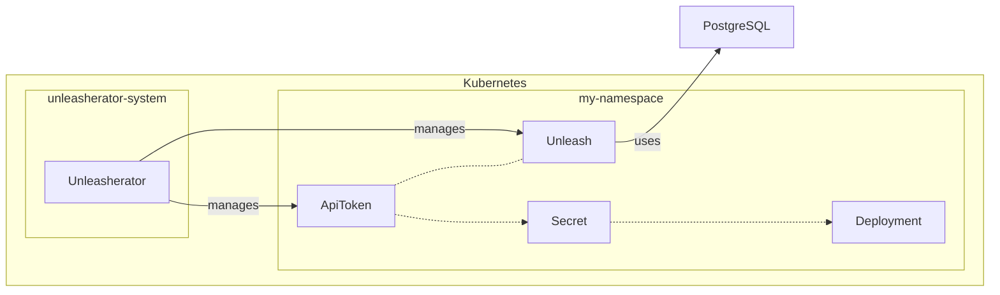

# Unleasherator

Kubernetes operator for managing [Unleash](https://getunleash.io) - the open-source feature toggle service.

It has support for creating and managing Unleash instances and API tokens across multiple clusters or environments and only depends on Kubernetes native resources.

Used in production at the Norwegian Labour and Welfare Administration (NAV).

## Description

Unleasherator is a Kubernetes operator for managing Unleash instances and API tokens across multiple clusters or environments. It is built using the [Kubebuilder](https://book.kubebuilder.io/) framework and is cloud and infrastructure agnostic.

## Key Features

- **Unleash Instance Management**: Deploy and manage Unleash…
