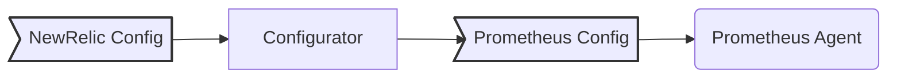

# New Relic Prometheus Configurator 

New Relic Prometheus Configurator (a.k.a. New Relic Prometheus Agent) gives you full observability of your services exposing [Prometheus](https://github.com/prometheus/prometheus) metrics.

This repo contains the code base of the `newrelic-prometheus-configurator` and the [Helm Chart](https://github.com/newrelic/newrelic-prometheus-configurator/blob/HEAD/charts/newrelic-prometheus-agent/README.md) to install the solution in Kubernetes.

The `newrelic-prometheus-configurator` uses a custom configuration that simplifies the experience related to configure features like discovery, filtering, metrics decoration, and sharding.

The `Configurator` generates a configuration file that is used to run a [Prometheus Server](https://github.com/prometheus/prometheus) in Agent mode, and send metrics to the New Relic Remote Write…
