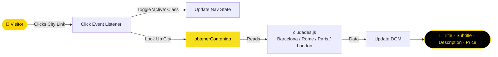

<br/>

  </a>
  </a>
  </a>
  </a>
  </a>
</p>

  </a>
  </a>
</p>

</div>

---

## 📋 Overview

**City Info Travel** is a travel sales application built with vanilla JavaScript. This tutorial-style project walks through building an app that displays information about different tourist cities and their associated prices. No frameworks or dependencies required.

---

## 🗂️ Project Structure

```text
CityInfoTravel/
└── assets/
    ├── css/          # Stylesheets
    ├── img/            # City images
    └── js/               # JavaScript logic (app.js, ciudades.js)
```

---

## 🔄 City Selection Flow



---

## 🛠️ Technologies Used

| Layer | Technologies |
|:------|:-------------|
| 🎨…
