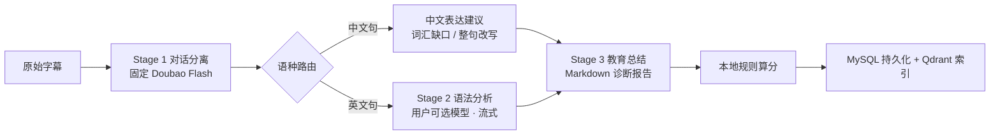

# Khan Kiddo v2

> 把你和 ChatGPT 的**英语口语对话**，变成一份可量化、可复盘的学习诊断报告。

线上站点：[khankiddo.top](https://khankiddo.top)

粘贴（或用浏览器扩展一键导入）一段 ChatGPT 语音对话字幕，Khan Kiddo 会逐句找出你的语法与表达问题、给出改写建议、算出自然度得分，并把所有错句沉淀成可检索的个人语料库 —— 之后你可以直接向 AI 助手提问「我最近最常犯的时态错误是什么」。

技术栈：**Java 21 + Spring Boot 3.5 + LangChain4j + MyBatis-Plus + MySQL 8 + Qdrant** ｜ **Vue 3 + Vite + TypeScript** ｜ **Chrome MV3 扩展**

---

## 核心亮点

### 1. 三阶段 LLM 流水线，SSE 全程流式

对话分析不是"一个 prompt 打包丢给大模型"，而是拆成职责单一、可分别换模型的阶段（`conversation/ConversationAnalysisPipeline.java`）：

| 阶段        | 职责                                  | 模型                                    | 设计要点                                      |
| --------- | ----------------------------------- | ------------------------------------- | ----------------------------------------- |
| Stage 1   | 字幕 → 结构化 `user`/`assistant` 消息，拆分多句 | **固定** `doubao-seed-1-6-flash-250828` |…
