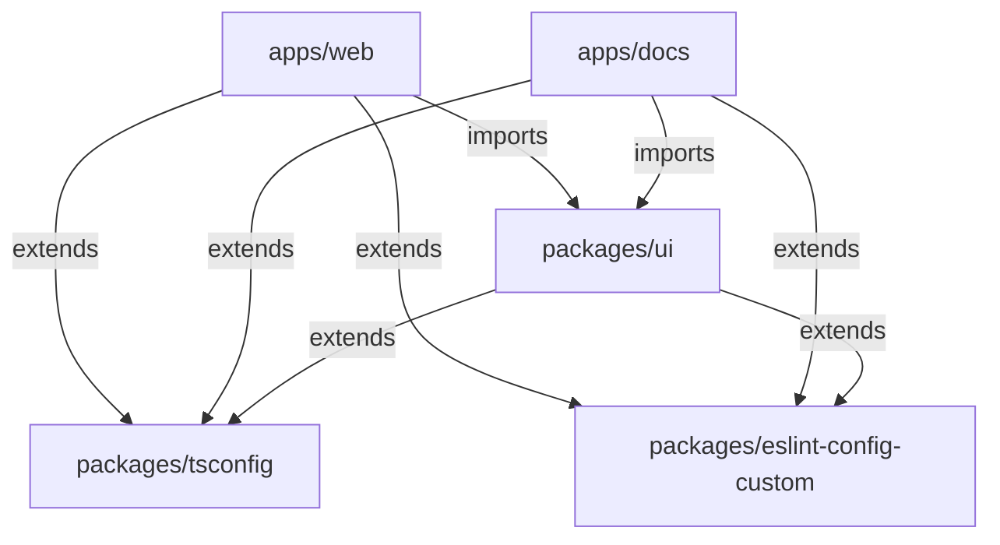

# Turborepo Example

A modern monorepo template built with Next.js 16, React 19, Tailwind CSS v4, TypeScript 5.9, Turborepo, and pnpm workspaces.

## Architecture

## What's Inside

### Apps

| App         | Description                           | Port |
| ----------- | ------------------------------------- | ---- |
| `apps/web`  | Next.js application with Tailwind CSS | 3000 |
| `apps/docs` | Nextra documentation site             | 3001 |

### Packages

| Package                         | Description                                                 |
| ------------------------------- | ----------------------------------------------------------- |
| `packages/ui`                   | Shared React component library (shadcn/ui, Radix, Tailwind) |
| `packages/tsconfig`             | Shared TypeScript configurations                            |
| `packages/eslint-config-custom` | Shared ESLint configuration…
