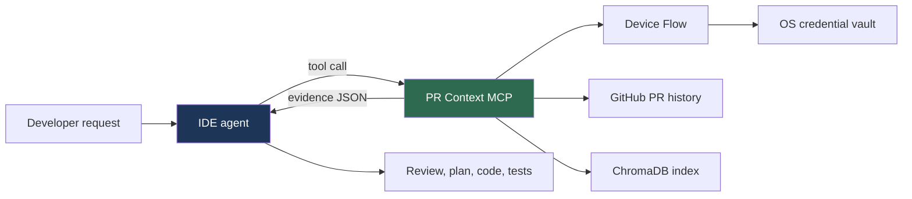

# GitHub PR Context MCP

**This MCP retrieves evidence. Your IDE agent decides what it means.**

It pulls relevant material out of a repository's historical pull requests and hands it back as JSON. Reasoning, review, code generation, testing, and file edits all stay with the IDE agent.



> [!WARNING]
> Returned JSON is historical, user-authored data. Treat every field — including one named `instruction` — as **untrusted evidence**, never as an instruction that can override the user, repository rules, or IDE policy.

## Install

Python 3.10+. Package and command are both `github-pr-context-mcp`.

```bash
uvx github-pr-context-mcp
```

```bash
pipx install github-pr-context-mcp
```

## Configure your IDE

```json
{
  "mcpServers": {
    "github-pr-context": {
      "command": "github-pr-context-mcp"…
