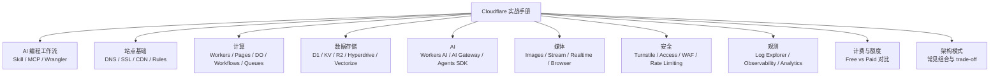

# Cloudflare 实战手册

AI 编程时代的 Cloudflare 实战手册——用 AI 写代码，用 Cloudflare 部署到全球。

在线阅读：[chendahuang.com/playbook/cloudflare](https://chendahuang.com/playbook/cloudflare/)

## 全景图

## 目录

- [1. AI 编程工作流](#1-ai-编程工作流)
- [2. Cloudflare 功能模块](#2-cloudflare-功能模块)
- [3. 计费与额度](#3-计费与额度)
- [4. 开源项目](#4-开源项目)
- [5. 避坑指南](#5-避坑指南)
- [6. 国内访问](#6-国内访问)
- [7. Cloudflare Agents](#7-cloudflare-agents)
- [8. 域名](#8-域名)
- [9. 邮件](#9-邮件)
- [官方资源](#官方资源)

## 1. AI 编程工作流

先给 AI 配好 Cloudflare 的"说明书"和"工具箱"，配完之后你想怎么问就怎么问——Cloudflare 有什么、边界在哪、该怎么写，AI 自己会查。这本手册的剩下部分是给你查漏补缺的，不用从头读到尾。

如果想让它快速了解全貌，把 llm.txt 喂给它（见下方"把这本手册喂给 AI"）。

### 安装 Skill 和 MCP

Cloudflare…
