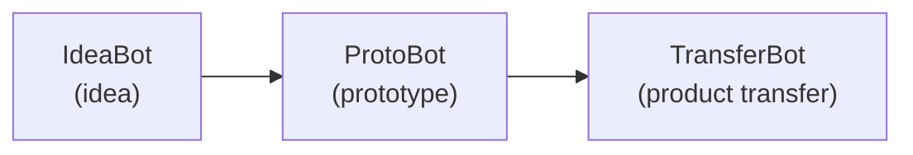

# ProtoBot

ProtoBot is an experimental, spec-first software development system. It
takes structured requirements and generates working, tested, inspected
prototypes for customer demonstrations. It is the second tool in the Hermes
pipeline:

ProtoBot is intended to produce prototypes, not final production products.
The implementation is a disposable, regenerable artifact. The durable asset
is the specification and the evidence showing how a particular implementation
conformed to it.

## Approach to Software Development

ProtoBot puts human judgment before implementation and automation after the
specification is approved:

1. **Sketching:** A person and an agent define the project's Vision and
   Architecture, including its observable external interfaces.
2. **Dimensioning:** They turn those interfaces into precise EARS
   (Easy Approach to Requirements Syntax) requirements. This approved
   Schematic is the human review boundary.
3. **Building:** Autonomous Workers independently generate tests and
   implementation from the…
