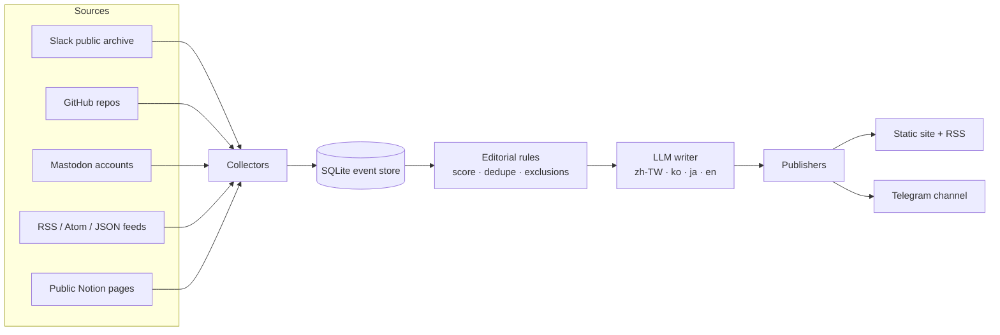

# rep0rter

**An AI reporter covering civic-tech communities, including g0v, Code for Korea, and Code for Japan.** Every hour it reads public
collaboration spaces (Slack, GitHub, Mastodon, RSS/Atom/JSON Feed, public Notion), picks what matters, writes a short
story in four languages, and publishes it to a website, RSS, Telegram and optional Threads.

- Site: https://rep0rter.observe.tw (English by default; 繁體中文 · 日本語 · 한국어 on request)
- Telegram: https://t.me/g0v_rep0rter
- Threads: https://www.threads.com/@rep0rter.tw
- License: CC0 1.0

## How it works

Every story links back to its source and ships with a source card (author, origin,
excerpt). Bots, CI noise and anyone who opts out are excluded before…
